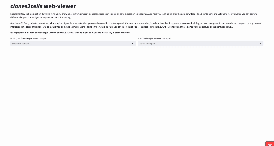

# clones2cells

Simple Streamlit application for interactive exploratory analysis of clonal embeddings.

## Web-page with application

Please visit https://clones2cells.streamlit.app to explore datasets from the paper *Erickson, Isaev et al*.

<p align="center"></p>

## How to use it locally

To run *clones2cells* locally, firstly, install dependencies:

```bash
pip install streamlit plotly streamlit_plotly_events pandas
```

After that, run the following command from the terminal:

```bash
streamlit run https://raw.githubusercontent.com/serjisa/clones2cells_app/main/clones2cells_viewer.py --theme.base light
```

Streamlit *clones2cells* app should be opened after execution of this command — and here you will be able to select files that you got from `prepare_clones2cells` function of `scLiTr` package (one csv-file for clonal embedding and one csv-file for gene expression embedding).

You also may use tables generated by your own: in this case make sure that (a) the first column of each table is an index, (b) index from clonal csv-file corresponds to the clonal labelling from the column clone in gene expression csv-file, (c) both tables have columns `UMAP1` and `UMAP2`.

Example: [clonal embedding](https://raw.githubusercontent.com/serjisa/clones2cells_app/main/data/clone2vec_control_trunk.csv) and [gene expression embedding](https://github.com/serjisa/clones2cells_app/raw/main/data/GEX_control_trunk_all.csv).
