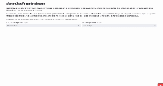

# The package is deprecated
Please, use built-in function `clone2vec.pp.clones2cells()`. Here is the detailed walkthrough: <a href="https://colab.research.google.com/github/serjisa/clones2cells_app/blob/main/clones2cells.ipynb">
  
</a>

<details>
<summary>📁 Old documentation (click to expand)</summary>

# clones2cells
## Web-page with application
Please visit https://clones2cells.streamlit.app to explore datasets from the paper *Erickson, Isaev et al*.
<p align="center"></p>

## How to use it locally
To run *clones2cells* locally, firstly, install dependencies:
​```bash
pip install streamlit plotly==5.24 streamlit_plotly_events pandas
​```
...rest of the content...

</details>
